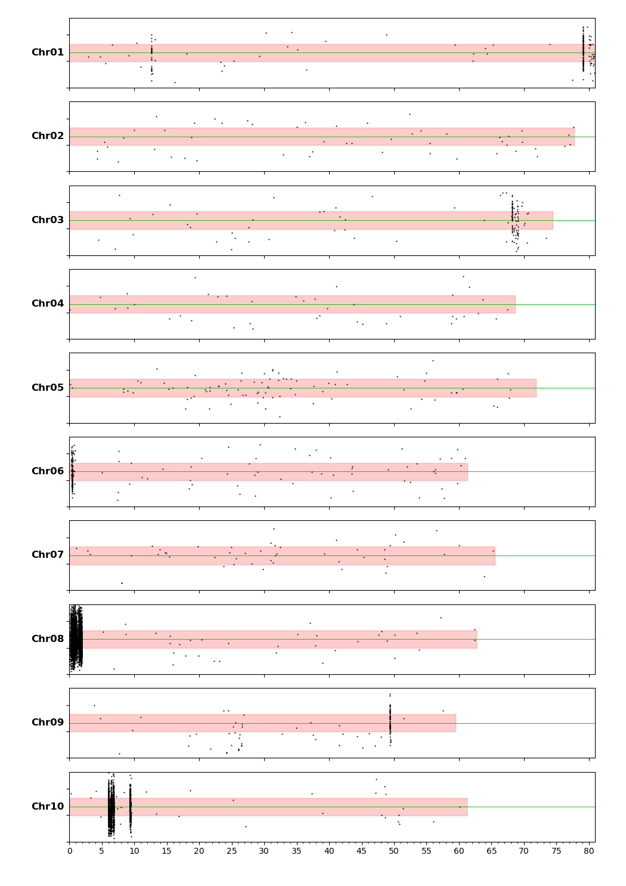
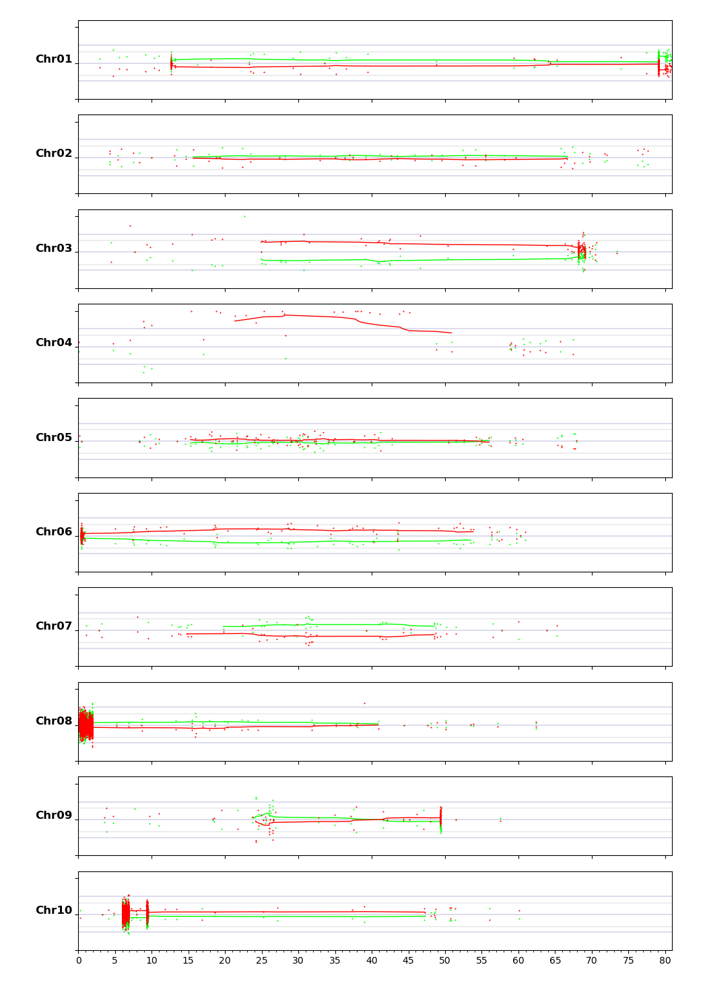
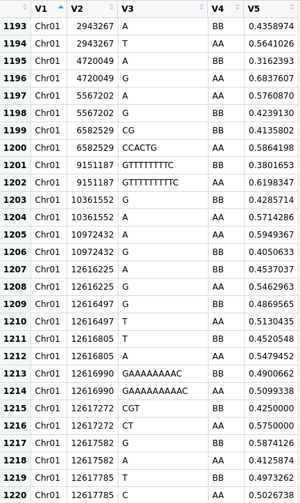

===================================
VCFHunter on Sorghum Semi-Dwarfism
===================================

=====================
:Author: Michael Hall
:Date: 07/18/2022
====================

Software Prerequisites
======================

#Download git repository:

.. code:: shell

	git clone https://github.com/SouthGreenPlatform/VcfHunter.git
	cd VcfHunter
	cd bin
	ls
	
	#See all available python scripts

	VCFtools (0.1.15)
	© Adam Auton and Anthony Marcketta 2009

	Process Variant Call Format files

	For a list of options, please go to:
	https://vcftools.github.io/man_latest.html

	Alternatively, a man page is available, type:
	man vcftools

	Questions, comments, and suggestions should be emailed to:
	vcftools-help@lists.sourceforge.net

Extract Sample names from VCF
=============================

.. code:: shell

	head -n 1000 freebayes_D2.filtered.vcf | grep "#CHROM" | sed 's/\t/\n/g' | tail -n +10 > all_names.tab

Filter VCF with python script
============================

.. code:: shell

	#Filter VCF
	python vcfFilter.1.0.py --vcf ../data/Sorghumvcf/freebayes_D2.filtered.vcf --names sorghum_all_names.tab 
	--MinCov 10 --MaxCov 300 --MinAl 3 --nMiss 1 --RmAlAlt 1:3:4:5:6 --prefix DNAseq_Filtered -g y

Separate VCF by chromomsome using vcftools
==========================================

.. code:: shell

	#Separate VCF by Chromosome
	vcftools --gzvcf DNAseq_Filtered_filt.vcf.gz --chr Chr01 --recode --out ../data/Sorghumvcf/Chr01_DNAseq_Filtered_filt.vcf.gz
	vcftools --gzvcf DNAseq_Filtered_filt.vcf.gz --chr Chr02 --recode --out ../data/Sorghumvcf/Chr02_DNAseq_Filtered_filt.vcf.gz
	vcftools --gzvcf DNAseq_Filtered_filt.vcf.gz --chr Chr03 --recode --out ../data/Sorghumvcf/Chr03_DNAseq_Filtered_filt.vcf.gz
	vcftools --gzvcf DNAseq_Filtered_filt.vcf.gz --chr Chr04 --recode --out ../data/Sorghumvcf/Chr04_DNAseq_Filtered_filt.vcf.gz
	vcftools --gzvcf DNAseq_Filtered_filt.vcf.gz --chr Chr05 --recode --out ../data/Sorghumvcf/Chr05_DNAseq_Filtered_filt.vcf.gz
	vcftools --gzvcf DNAseq_Filtered_filt.vcf.gz --chr Chr06 --recode --out ../data/Sorghumvcf/Chr06_DNAseq_Filtered_filt.vcf.gz
	vcftools --gzvcf DNAseq_Filtered_filt.vcf.gz --chr Chr07 --recode --out ../data/Sorghumvcf/Chr07_DNAseq_Filtered_filt.vcf.gz
	vcftools --gzvcf DNAseq_Filtered_filt.vcf.gz --chr Chr08 --recode --out ../data/Sorghumvcf/Chr08_DNAseq_Filtered_filt.vcf.gz
	vcftools --gzvcf DNAseq_Filtered_filt.vcf.gz --chr Chr09 --recode --out ../data/Sorghumvcf/Chr09_DNAseq_Filtered_filt.vcf.gz
	vcftools --gzvcf DNAseq_Filtered_filt.vcf.gz --chr Chr10 --recode --out ../data/Sorghumvcf/Chr10_DNAseq_Filtered_filt.vcf.gz

VCF Configuration file
======================

.. code:: shell

	#Create a new vcf configuration file and fill it with this information(SorghumVcf.conf)

	../data/Sorghumvcf/Chr01_DNAseq_Filtered_filt.vcf.gz.recode.vcf
	../data/Sorghumvcf/Chr02_DNAseq_Filtered_filt.vcf.gz.recode.vcf
	../data/Sorghumvcf/Chr03_DNAseq_Filtered_filt.vcf.gz.recode.vcf
	../data/Sorghumvcf/Chr04_DNAseq_Filtered_filt.vcf.gz.recode.vcf
	../data/Sorghumvcf/Chr05_DNAseq_Filtered_filt.vcf.gz.recode.vcf
	../data/Sorghumvcf/Chr06_DNAseq_Filtered_filt.vcf.gz.recode.vcf
	../data/Sorghumvcf/Chr07_DNAseq_Filtered_filt.vcf.gz.recode.vcf
	../data/Sorghumvcf/Chr08_DNAseq_Filtered_filt.vcf.gz.recode.vcf
	../data/Sorghumvcf/Chr09_DNAseq_Filtered_filt.vcf.gz.recode.vcf
	../data/Sorghumvcf/Chr10_DNAseq_Filtered_filt.vcf.gz.recode.vcf

.. code:: shell

Create a Origin tab delimited file
==================================

.. code:: shell

	#Create a new Origin tab delimited file and fill it with this information (SorghumOrigin.tab)

	con-all AA
	D2      BB

Create a Color configuration file
================================

.. code:: shell
	
	#Create a new color configuration file and fill it with this information (SorghumColor.conf)

	AA 0 255 0
	BB 255 0 0 

	
Run vcf2allPropandCov python script
===================================

.. code:: shell

	#Run python script
	python vcf2allPropAndCov.py --conf ../data/config/SorghumVcf.conf --origin ../data/config/SorghumOrigin.tab --acc D2_F2_tt --ploidy 2 --dcurve y --col /data/config/SorghumColor.conf
	
	python vcf2allPropAndCovByChr.py --conf ../data/config/SorghumVcf.conf --origin ../data/config/SorghumOrigin.tab --acc D2_F2_TT,D2_F2_tt --ploidy 2 --NoMiss n --all y

Plots
=====

